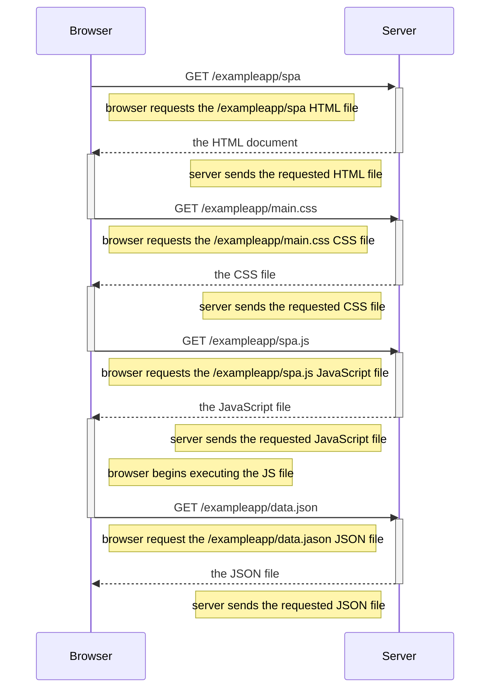

# Single Page Application Load Sequence Diagram

The following sequence diagram demonstrates the steps that occur after a user loades an [example single page application](https://studies.cs.helsinki.fi/exampleapp/spa).

