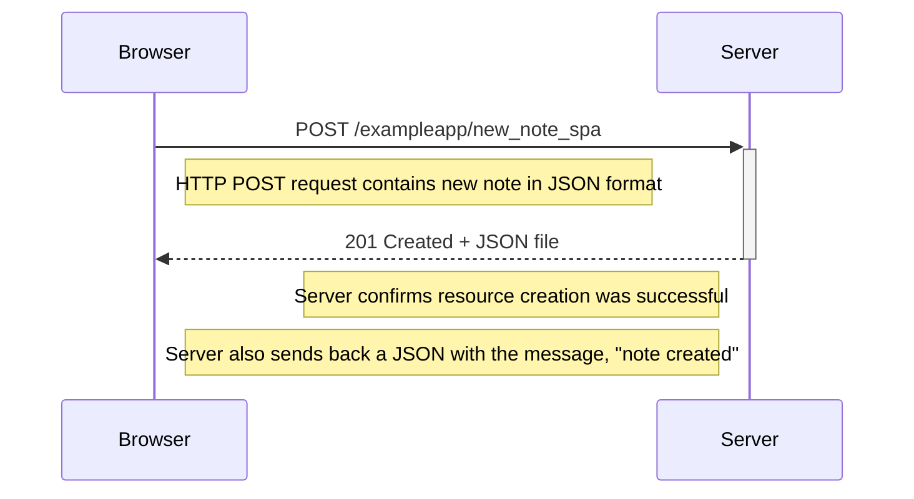

# New Note SPA Sequence Diagram

The following sequence diagram demonstrates the steps that occur after a user presses the Save button on <https://studies.cs.helsinki.fi/exampleapp/spa> after writing a note in the input element.

